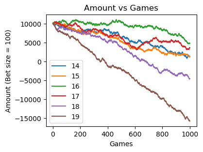
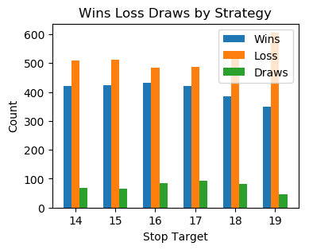

# Monte-Carlo-Simulation-for-Blackjack
Monte Carlo Simulation for discovering optimum winning strategy in the game of Blackjack. The game is standard blackjack where two cards are initially dealt to the player and the dealer. The player can choose to hit or stand till they are satisfied with their standing. The dealer then proceeds to hit until they have 17 or higher. The options to double up or split in the middle of the game are not available.

## Part I

This simulation attempts to discover a simple strategy for the player to keep hitting until a certain target is reached without taking into consideration what the dealer has.

Initial amount in the simulation has been set to 10,000 and the wager is fixed at 100 for all games. There are 5 different players with different target points that play a maximum of 1000 games. The games aren't continued if they go broke.

 
